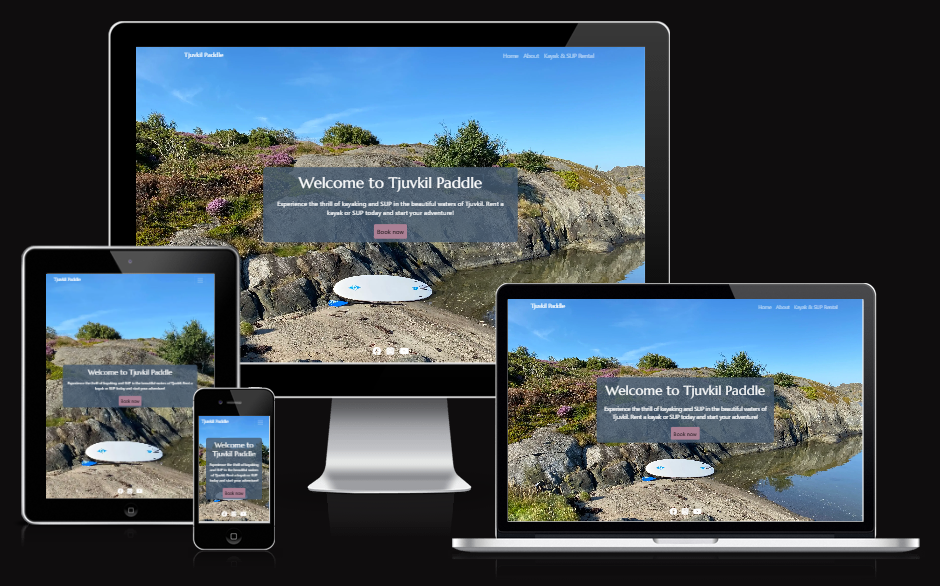
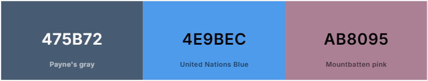

# Tjuvkil Paddle

Tjuvkil Paddle is a fictional company created as part of a school project for **Lab 1 - Web Development with .NET**. The website serves as an online platform for renting sea kayaks and stand-up paddleboards (SUP) in Tjuvkil Harbor, catering to all skill levels. Whether you are looking for a relaxing day on the water or an adventurous exploration of the beautiful coastline, Tjuvkil Paddle provides everything you need for an unforgettable experience.

This project was developed as a prototype to meet the requirements for a school assignment, focusing on web development principles, structure, and usability.

## Features

1. **Landing Page**: A welcoming page showcasing the company name, a relevant image, and a brief introduction to the services offered.

2. **About Us Page**: Learn more about Tjuvkil Paddle, the company's mission, and how to get in touch.

3. **Services Page**: A list of rental services, featuring details about the sea kayaks and SUPs available, along with a simple shopping cart functionality.

## Design

### Colors

## Technologies Used

### Languages Used

- HTML
- CSS
- JavaScript

### Frameworks, Libraries, Tools & Programs

- [Adobe Express:](https://new.express.adobe.com/)- Adobe Express was used to resizing images.
- [Bootstrap](https://getbootstrap.com/docs/5.0/getting-started/introduction/) - Used to design the website and make it responsive.
- [Coolors](https://coolors.co/) - Used to create colour palette based on de background image.
- [Fontawesome](https://fontawesome.com/) - Used for social media icons.
- [Git](https://git-scm.com/) - Used for version control.
- [GitHub](https://github.com/) - Used to store the code.
- [GitHub Desktop](https://github.com/apps/desktop) - Used as a tool to simplify Git workflow.
- [Google Maps Embedded Module](https://developers.google.com/maps/documentation/embed/get-started) - Used to embed an interactive map in the "About Us" page, showing the location of Tjuvkil Paddle.
- [OpenWeather API](https://openweathermap.org/) - Used to fetch real-time weather data for Tjuvkil Harbor, enhancing the user experience with weather forecasts.
- [Visual Studio Code](https://code.visualstudio.com/) - Used as the IDE for development.
- [Tinify](https://tinypng.com/) - Used to convert and reduce the size of images.
